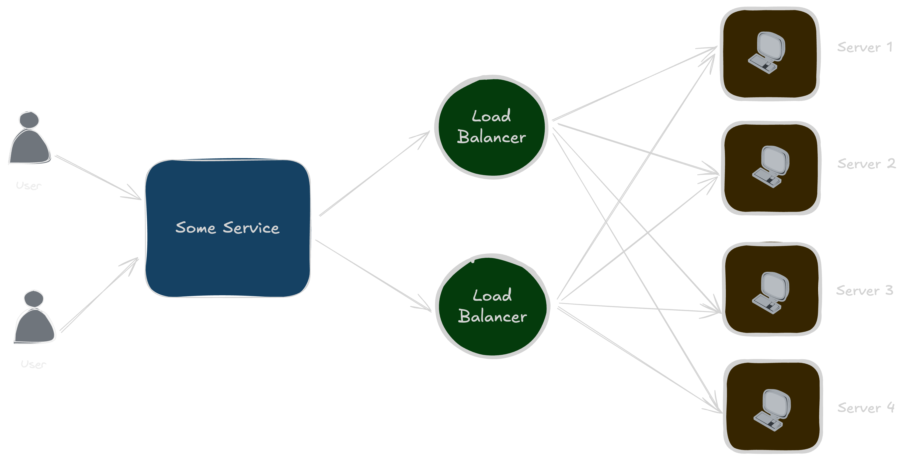

## Availability
Availability, in its simplest terms, refers to the state of being accessible and ready for use. While applicable in numerous contexts, from human resources to supply chains, the concept finds its most critical and detailed application in the realm of technology and service-oriented industries. In this domain, availability is a precise metric representing the proportion of time a system is operational and capable of delivering its intended function.

## Strategies for Enhancing Availability
Improving and maintaining high availability is an ongoing process that involves a combination of proactive design, robust processes, and diligent monitoring. Key strategies include:
- **Redundancy:** Eliminating single points of failure by duplicating critical components of the system. This can range from redundant power supplies and network cards to entire replicated server environments.
- **Failover:** Implementing automatic mechanisms that switch to a redundant component or system in the event of a failure, minimizing or eliminating downtime.
- **Load Balancing:** Distributing incoming traffic across multiple servers to prevent any single server from becoming overwhelmed, which can lead to performance degradation and outages.
- **Comprehensive Monitoring and Alerting:** Continuously monitoring the health and performance of the system to detect potential issues before they cause a failure. Automated alerts ensure that the appropriate personnel are notified immediately.
- **Effective Backup and Recovery:** Regularly backing up critical data and having a well-tested disaster recovery plan in place to restore service quickly in the event of a major failure.
- **Proactive Maintenance:** Performing regular preventive maintenance to identify and address potential problems before they lead to unexpected downtime.
- **Scalability:** Designing the system to handle increases in workload and traffic without a degradation in performance or availability.
- **Robust Change Management:** Implementing a formal process for managing changes to the system to minimize the risk of introducing errors that could impact availability.